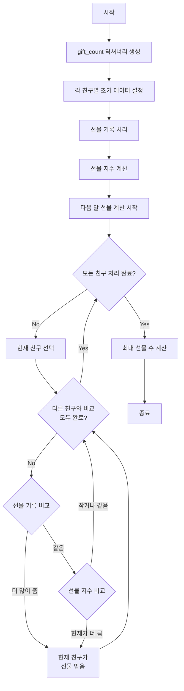

# 가장 많이 받은 선물

## 문제 설명
카카오톡 선물하기 기능을 이용한 선물 주고받기 기록을 바탕으로 다음 달에 가장 많은 선물을 받을 친구의 선물 수를 예측하는 문제입니다.

## 알고리즘 순서도


## 문제 해결 방법
1. 선물 주고받은 기록과 선물 지수 계산
2. 모든 친구 쌍에 대해 다음 달 선물 계산
   - 선물 기록이 다른 경우: 더 많이 준 사람이 받음
   - 선물 기록이 같은 경우: 선물 지수가 큰 사람이 받음
3. 가장 많은 선물을 받는 수 반환

## 제약 조건
- 2 ≤ friends의 길이 ≤ 50
- friends의 원소는 길이가 10 이하인 알파벳 소문자 문자열
- 1 ≤ gifts의 길이 ≤ 10,000
- gifts의 원소는 "A B" 형태의 문자열

## 구현 설명
```python
# 선물 기록 초기화
gift_count = {friend: {f: 0 for f in friends if f != friend} for friend in friends}
for friend in friends:
    gift_count[friend].update({
        "gived": 0,
        "received": 0,
        "will_receive": 0
    })

# 선물 지수 계산
for friend in friends:
    gift_count[friend]["gift_point"] = gift_count[friend]["gived"] - gift_count[friend]["received"]
```

## 성능 분석
- 시간 복잡도: O(N² + M)
  - N: friends 배열의 길이
  - M: gifts 배열의 길이
- 공간 복잡도: O(N²)
  - gift_count 딕셔너리 저장

## 개선 사항
- 메모리 사용량 최적화
- 선물 기록 처리 효율화
- 대용량 데이터 처리 방안 고려 