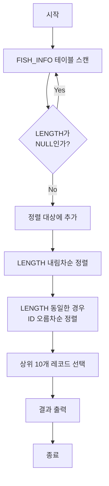

# 가장 큰 물고기 10마리 구하기

## 문제 설명
낚시앱의 FISH_INFO 테이블에서 가장 큰 물고기 10마리를 찾아 ID와 길이를 출력하는 SQL 문제입니다.

## 알고리즘 순서도


## 문제 해결 방법
1. NULL 값(10cm 이하 물고기) 제외
2. 길이 기준 내림차순 정렬
3. 길이가 같은 경우 ID 기준 오름차순 정렬
4. 상위 10개 결과 반환

## 제약 조건
- LENGTH가 NULL인 경우는 10cm 이하를 의미
- LENGTH에 NULL만 있는 경우는 없음
- 결과의 상위 10개 물고기는 모두 10cm 초과

## 실행 방법
```sql
-- solution.sql 실행
SELECT ID, LENGTH
FROM FISH_INFO
WHERE LENGTH IS NOT NULL
ORDER BY LENGTH DESC, ID ASC
LIMIT 10;
```

## 성능 분석
- 시간 복잡도: O(n log n)
- 주요 연산: ORDER BY (정렬)
- 최적화: LENGTH IS NOT NULL 조건 선처리

## 개선 사항
- LENGTH, ID 컬럼에 대한 인덱스 생성 고려
- 대용량 데이터의 경우 페이지네이션 적용 검토 