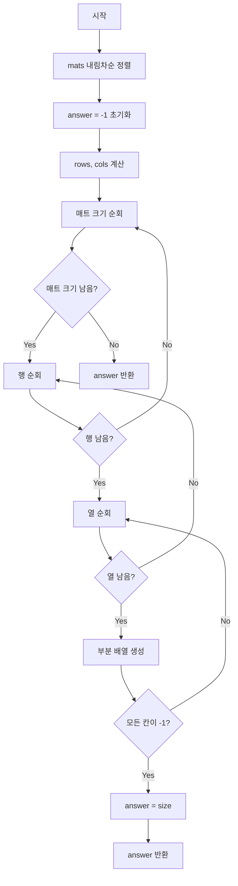

# 공원 문제

## 문제 설명
지민이는 다양한 크기의 정사각형 모양 돗자리를 가지고 공원에 소풍을 나왔습니다. 공원에는 이미 돗자리를 깔고 여가를 즐기는 사람들이 많아 지민이가 깔 수 있는 가장 큰 돗자리가 어떤 건지 확인하려 합니다.

## 알고리즘 순서도


## 실행 방법
```bash
python solution.py
```

## 테스트 방법
```bash
python solution.py
```
실행하면 자동으로 테스트 케이스가 실행됩니다.

## 성능 분석
- 시간 복잡도: O(n log n + R * C * k * k)
  - n: mats의 길이
  - R: park의 행 수
  - C: park의 열 수
  - k: 돗자리 크기
- 공간 복잡도: O(R * C)

## 개선 사항
1. 입력값 검증 강화
   - park 배열의 각 행의 길이가 동일한지 확인
   - mats의 각 원소가 유효한 범위 내에 있는지 확인

2. 성능 최적화
   - 빈 공간의 위치를 미리 저장하여 탐색 범위 축소
   - 돗자리 크기별로 가능한 위치를 미리 계산

3. 코드 가독성
   - 돗자리 크기 검사 로직을 별도 함수로 분리
   - 상수값을 명명된 상수로 정의

## 파일 구조
- solution.py: 메인 솔루션 코드
- 문제_설명.txt: 문제 요구사항 및 설명
- 문제_분석.txt: 알고리즘 분석 및 접근 방법
- 구현_알고리즘.txt: 상세 구현 방법
- README.md: 프로젝트 설명 