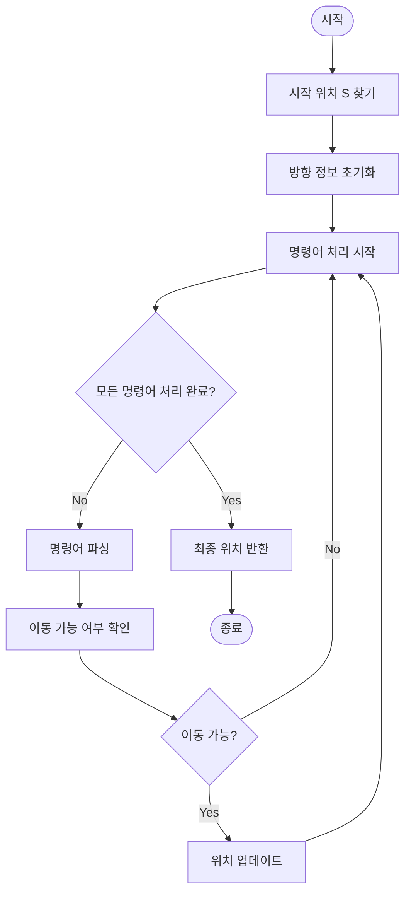

# 공원 산책

## 문제 설명 요약
로봇 강아지가 공원을 산책하는 문제입니다. 공원은 직사각형 격자 모양이며, 'O'는 이동 가능한 통로, 'X'는 장애물, 'S'는 시작 지점을 나타냅니다. 주어진 명령에 따라 로봇 강아지를 이동시키고, 최종 위치를 반환해야 합니다.

## 알고리즘 순서도


## 실행 방법
```python
# 예시 실행
park = ["SOO","OOO","OOO"]
routes = ["E 2","S 2","W 1"]
result = solution(park, routes)
print(result)  # [2, 1]
```

## 테스트 방법
```python
# 테스트 실행
python solution.py
```

## 성능 분석
- 시간 복잡도: O(N*M + K*L)
  - N: 공원의 세로 길이
  - M: 공원의 가로 길이
  - K: 명령어 수
  - L: 최대 이동 거리

- 공간 복잡도: O(N*M)
  - 입력 공원 지도 저장 공간

## 개선 사항
1. 시작 위치 찾기 최적화
   - 시작 위치를 찾으면 즉시 탐색 중단

2. 이동 가능 여부 확인 최적화
   - 불가능한 경우 즉시 중단
   - 중복 검사 제거

3. 방향 정보 처리 최적화
   - 방향 정보를 미리 정의하여 재사용
   - 불필요한 계산 제거 