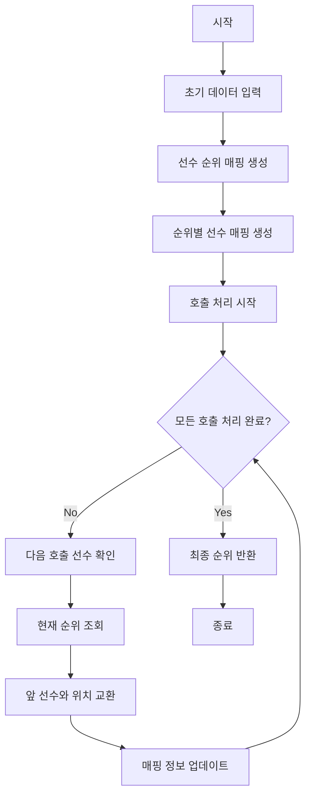

# 달리기 경주

## 문제 설명
달리기 경주에서 선수들의 추월 상황을 처리하는 프로그램입니다. 해설진이 호명한 선수의 순위 변경을 처리하고 최종 순위를 반환합니다.

## 알고리즘 순서도


## 실행 방법
```bash
python solution.py
```

## 테스트 방법
- 자동 테스트: 프로그램 실행 시 자동으로 테스트 케이스 실행
- 테스트 케이스:
  1. 기본 테스트 케이스 (문제 예시)
  2. 연속 추월 테스트
  3. 단일 선수 여러 번 추월
  4. 여러 선수 각각 한 번씩 추월

## 성능 분석
- 시간 복잡도: O(n + m)
  - 초기 해시맵 생성: O(n)
  - 각 호출 처리: O(1)
  - 전체 호출 처리: O(m)
- 공간 복잡도: O(n)
  - 선수 이름-순위 매핑: O(n)
  - 순위-선수 이름 매핑: O(n)

## 개선 사항
1. 성능 최적화
   - 대용량 데이터 처리를 위한 메모리 최적화
   - 호출 처리 시 불필요한 연산 제거
   - 데이터 구조 접근 최적화

2. 기능 확장
   - 다중 선수 동시 순위 변경 지원
   - 역방향 추월 지원
   - 실시간 순위 변동 조회 기능

3. 안정성 향상
   - 입력값 유효성 검증 추가
   - 예외 상황 처리 강화
   - 데이터 일관성 검증 기능 