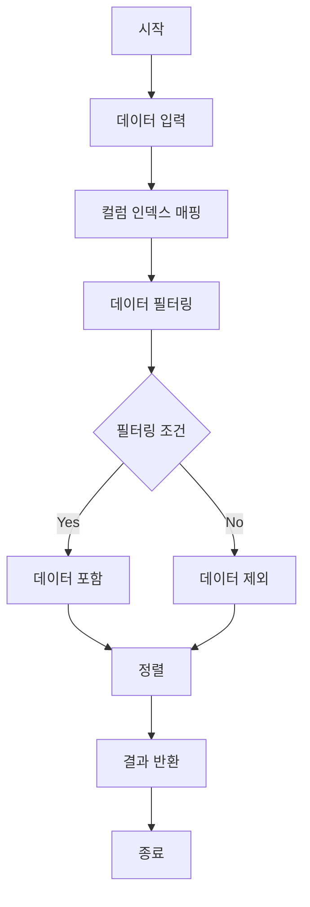

# 데이터 분석

## 문제 설명
AI 엔지니어가 데이터를 분석하는 작업을 수행하는 프로그램입니다. 주어진 데이터에서 특정 조건을 만족하는 데이터를 추출하고 정렬하는 기능을 구현합니다.

## 알고리즘 순서도


## 실행 방법
```bash
python solution.py
```

## 테스트 방법
- 자동 테스트: 프로그램 실행 시 자동으로 테스트 케이스 실행
- 테스트 케이스:
  1. 기본 테스트 케이스 (문제 예시)
  2. 코드 번호 기준 필터링 및 정렬
  3. 최대 수량 기준 필터링 및 정렬
  4. 현재 수량 기준 필터링 및 정렬

## 성능 분석
- 시간 복잡도: O(n log n)
  - 데이터 필터링: O(n)
  - 데이터 정렬: O(n log n)
- 공간 복잡도: O(n)
  - 필터링된 데이터 저장: O(n)
  - 정렬된 데이터 저장: O(n)

## 개선 사항
1. 입력값 검증 추가
   - 데이터 형식 및 범위 검증
   - 잘못된 입력에 대한 예외 처리

2. 성능 최적화
   - 대용량 데이터 처리를 위한 메모리 최적화
   - 병렬 처리 적용 가능성 검토

3. 기능 확장
   - 정렬 방향 선택 옵션 추가
   - 다중 조건 필터링 지원
   - 다중 컬럼 정렬 지원 