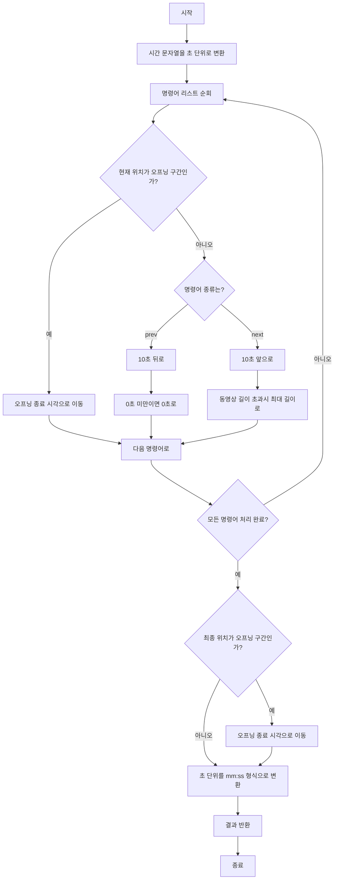

# 동영상 재생기

## 문제 설명
동영상 재생기의 명령어를 처리하는 프로그램입니다. 10초 전/후 이동과 오프닝 건너뛰기 기능을 지원합니다.

## 주요 기능
1. 10초 전으로 이동 (prev)
2. 10초 후로 이동 (next)
3. 오프닝 건너뛰기 (자동)

## 실행 방법
```bash
python solution.py
```

## 테스트 방법
1. solution.py 파일을 실행하면 자동으로 테스트 케이스가 실행됩니다.
2. 각 테스트 케이스의 입력, 출력, 예상 결과가 표시됩니다.
3. 테스트 결과가 성공/실패로 표시됩니다.

## 성능 분석
- 시간 복잡도: O(n)
  - n: commands 배열의 길이
  - 각 명령어마다 O(1) 시간에 처리
- 공간 복잡도: O(1)
  - 입력 크기와 무관하게 일정한 공간만 사용

## 개선 사항
1. 시간 형식 검증 강화
2. 예외 처리 개선
3. 테스트 케이스 추가
4. 성능 최적화

## 파일 구조
- solution.py: 메인 솔루션 파일
- 문제_설명.txt: 문제 요구사항 및 설명
- 문제_분석.txt: 알고리즘 분석 및 접근 방법
- 구현_알고리즘.txt: 상세 구현 방법
- README.md: 프로젝트 설명 

## 알고리즘 순서도

