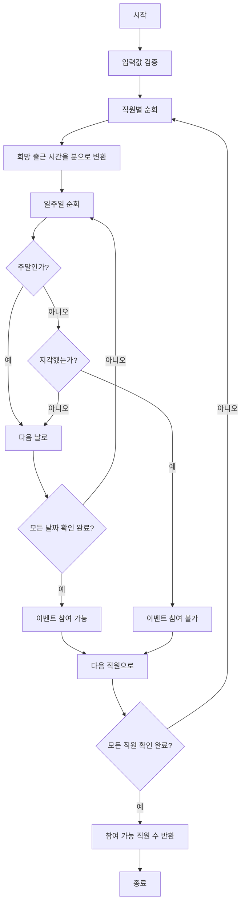

# 유연근무제

## 문제 설명
직원들의 출근 시간을 체크하여 이벤트 참여 가능한 직원 수를 계산하는 프로그램입니다.

## 주요 기능
1. 직원별 출근 희망 시각 설정
2. 일주일간의 실제 출근 시간 기록
3. 주말 제외한 평일 출근 시간 체크
4. 이벤트 참여 가능 직원 수 계산

## 실행 방법
```bash
python solution.py
```

## 테스트 방법
1. solution.py 파일을 실행하면 자동으로 테스트 케이스가 실행됩니다.
2. 각 테스트 케이스의 입력, 출력, 예상 결과가 표시됩니다.
3. 테스트 결과가 성공/실패로 표시됩니다.

## 성능 분석
- 시간 복잡도: O(n * m)
  - n: 직원 수
  - m: 일주일의 일수 (7)
- 공간 복잡도: O(n * m)
  - 직원별 출근 기록 저장

## 개선 사항
1. 입력값 검증 강화
2. 예외 처리 개선
3. 테스트 케이스 추가
4. 성능 최적화

## 파일 구조
- solution.py: 메인 솔루션 파일
- 문제_설명.txt: 문제 요구사항 및 설명
- 문제_분석.txt: 알고리즘 분석 및 접근 방법
- 구현_알고리즘.txt: 상세 구현 방법
- README.md: 프로젝트 설명

## 알고리즘 순서도

