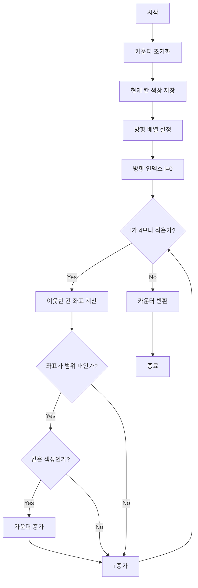

# 이웃한 칸

## 문제 설명
2차원 격자 보드판에서 선택한 칸의 이웃한 칸들 중 같은 색상으로 칠해진 칸의 개수를 찾는 문제입니다.

## 알고리즘 순서도


## 문제 해결 방법
1. 초기화
   - 보드 크기 확인
   - 카운터 초기화
   - 현재 위치 색상 저장

2. 방향 처리
   - 상하좌우 4방향 정의
   - 방향 배열 활용

3. 이웃한 칸 확인
   - 범위 체크
   - 색상 비교
   - 카운트 증가

## 제약 조건
- 1 ≤ board의 길이 ≤ 7
- board는 정사각형
- 1 ≤ board[h][w]의 길이 ≤ 10
- board[h][w]는 영어 소문자로만 구성
- 0 ≤ h, w < board의 길이

## 구현 설명
```python
# 방향 배열 정의
dh = [0, 1, -1, 0]  # 세로 방향
dw = [1, 0, 0, -1]  # 가로 방향

# 4방향 순회
for i in range(4):
    h_check = h + dh[i]
    w_check = w + dw[i]
    
    # 범위 체크 및 색상 비교
    if 0 <= h_check < n and 0 <= w_check < n:
        if board[h_check][w_check] == current_color:
            count += 1
```

## 성능 분석
- 시간 복잡도: O(1)
  - 상수 시간 (4방향 확인)
- 공간 복잡도: O(1)
  - 고정 크기 변수만 사용

## 개선 사항
- 방향 배열을 통한 코드 최적화
- 범위 체크 단순화
- 색상 비교 효율화 