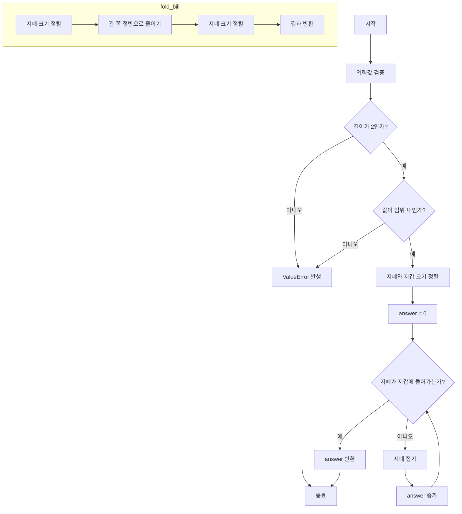

# 지폐 접기 문제

## 문제 설명
민수는 다양한 지폐를 수집하는 취미를 가지고 있습니다. 지폐마다 크기가 달라 지갑에 넣으려면 여러 번 접어서 넣어야 합니다. 지폐를 접을 때는 다음과 같은 규칙을 지킵니다:

1. 지폐를 접을 때는 항상 길이가 긴 쪽을 반으로 접습니다.
2. 접기 전 길이가 홀수였다면 접은 후 소수점 이하는 버립니다.
3. 접힌 지폐를 그대로 또는 90도 돌려서 지갑에 넣을 수 있다면 그만 접습니다.

## 실행 방법
```bash
python solution.py
```

## 테스트 방법
- solution.py 파일을 실행하면 자동으로 테스트가 수행됩니다.
- 테스트 케이스:
  1. wallet = [30, 15], bill = [26, 17] → 1
  2. wallet = [50, 50], bill = [100, 241] → 4

## 성능 분석
- 시간 복잡도: O(log(max(bill)))
- 공간 복잡도: O(1)

## 개선 사항
1. 더 많은 테스트 케이스 추가
2. 예외 처리 강화
3. 성능 최적화

## 알고리즘 순서도
