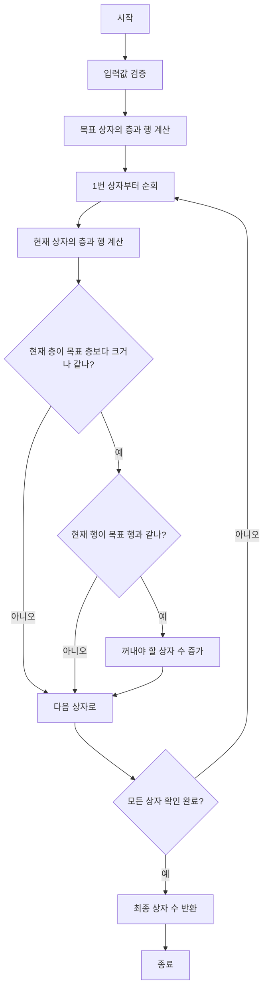

# 택배 상자 꺼내기

## 문제 설명
창고에 쌓여있는 택배 상자들 중 특정 상자를 꺼내기 위해 필요한 상자의 총 개수를 계산하는 프로그램입니다.

## 주요 기능
1. 상자 번호를 통한 층과 행 위치 계산
2. 짝수/홀수 층에 따른 행 방향 처리
3. 목표 상자까지의 상자 개수 계산

## 실행 방법
```bash
python solution.py
```

## 테스트 방법
1. solution.py 파일을 실행하면 자동으로 테스트 케이스가 실행됩니다.
2. 각 테스트 케이스의 입력, 출력, 예상 결과가 표시됩니다.
3. 테스트 결과가 성공/실패로 표시됩니다.

## 성능 분석
- 시간 복잡도: O(n)
  - n: 전체 상자의 개수
- 공간 복잡도: O(1)
  - 상수 공간만 사용

## 개선 사항
1. 입력값 검증 강화
2. 예외 처리 개선
3. 테스트 케이스 추가
4. 성능 최적화

## 파일 구조
- solution.py: 메인 솔루션 파일
- 문제_설명.txt: 문제 요구사항 및 설명
- 문제_분석.txt: 알고리즘 분석 및 접근 방법
- 구현_알고리즘.txt: 상세 구현 방법
- README.md: 프로젝트 설명

## 알고리즘 순서도

