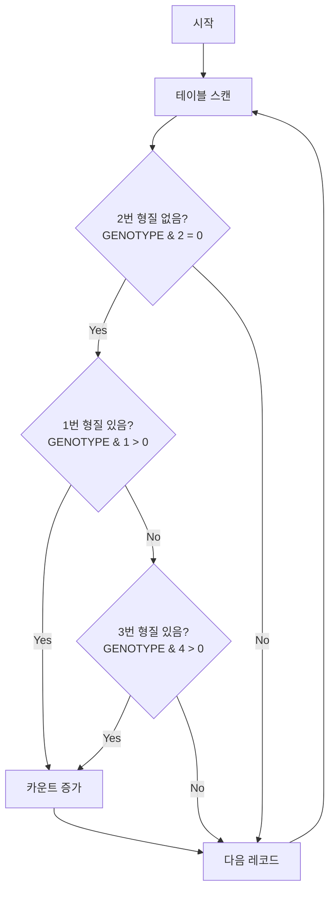

# 특이 형질을 가지는 대장균 찾기

## 문제 설명
대장균들의 형질 정보를 분석하여 특정 조건을 만족하는 대장균의 수를 찾는 SQL 문제입니다.

## 알고리즘 순서도


## 실행 방법
```sql
-- solution.sql 파일의 쿼리 실행
SELECT COUNT(*) AS COUNT
FROM ECOLI_DATA
WHERE (GENOTYPE & 2) = 0
  AND (GENOTYPE & 1 > 0 OR GENOTYPE & 4 > 0);
```

## 성능 분석
- 시간 복잡도: O(N)
  - N: ECOLI_DATA 테이블의 레코드 수
  - 각 레코드당 비트 연산: O(1)
- 공간 복잡도: O(1)
  - 단일 COUNT 값만 저장

## 개선 사항
1. 인덱스 최적화
   - GENOTYPE 컬럼에 대한 인덱스 고려
   - 비트 연산에 대한 인덱스 활용 가능성 검토

2. 쿼리 최적화
   - 조건절 순서 최적화
   - 비트 연산 효율성 검토

3. 대용량 데이터 처리
   - 파티셔닝 고려
   - 병렬 처리 가능성 검토

## 파일 구조
- solution.sql: SQL 쿼리 파일
- 문제_설명.txt: 문제 요구사항 및 설명
- 문제_분석.txt: SQL 분석 및 접근 방법
- 구현_알고리즘.txt: 상세 구현 방법
- README.md: 프로젝트 설명 